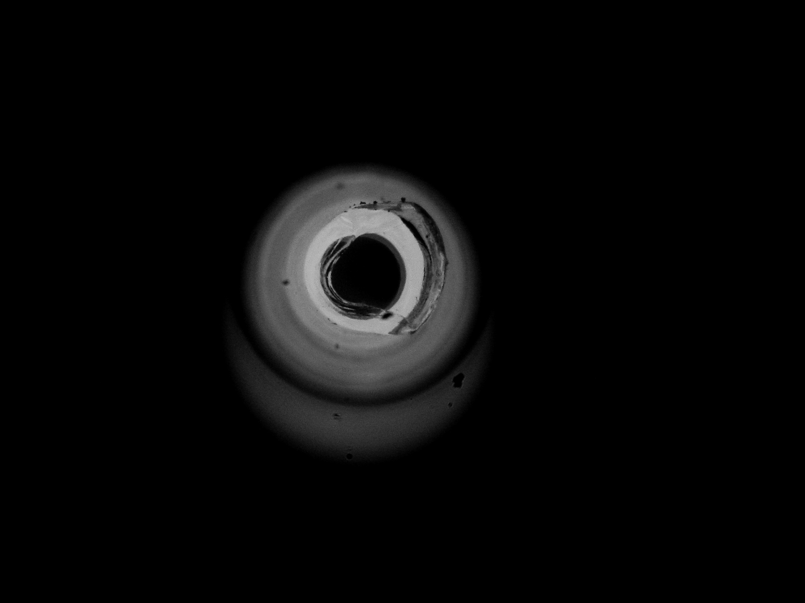
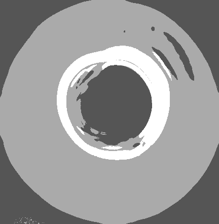
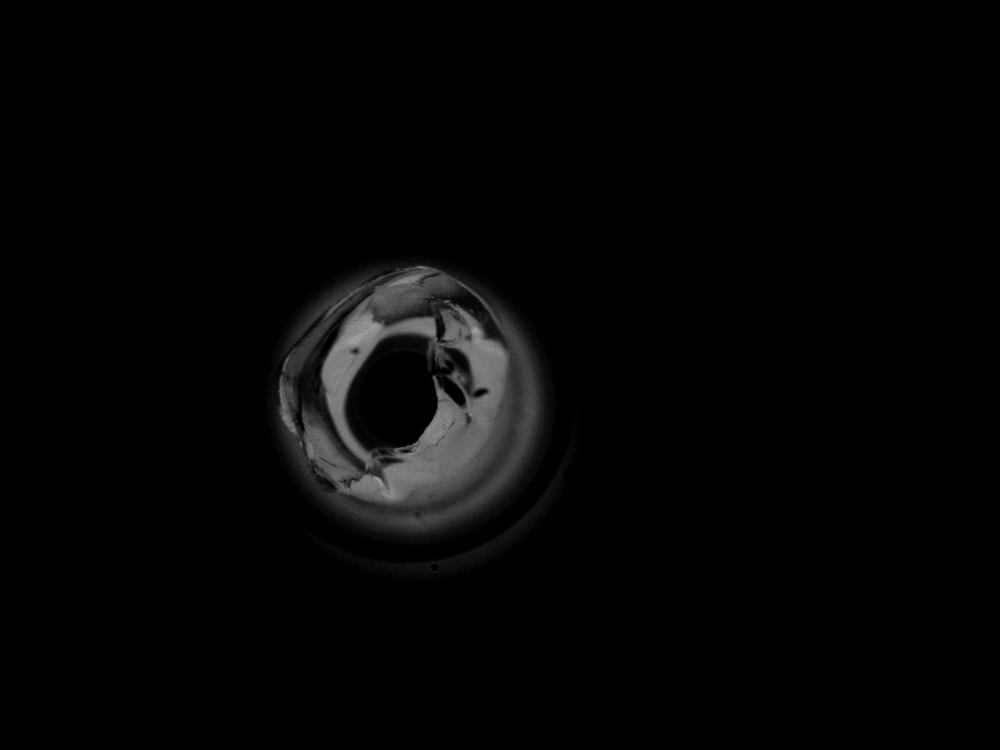
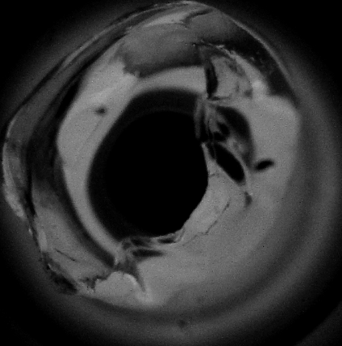
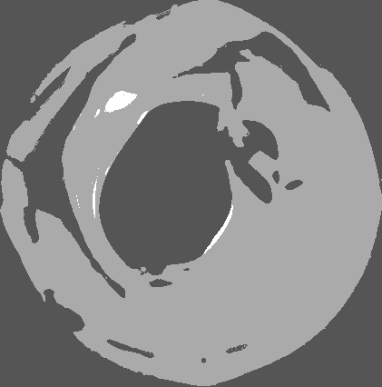

# FastConsumableQC.Vision

## Requirements
- Python 3.11
- skimage: `pip install scikit-image`
- OpenCV2: `pip install opencv-python`
- Other needed libraries will be installed automatically during the installation of those two libraries.
- Furthermore, in my case, some are installed automatically by anaconda once I created a new environment. So it might be not always same.

## Run the code:
- Set active directory to `/FastConsumableQC.Vision/src/`
- `python main.py`

## How to use:
- You could input whether a single image or a folder that contains many images by modifying main.py
- Example for inferencing by inputing a folder whcih contains many images
    - `isFolder = True`
    - `dataset = 'dataset`
- Example for inferencing by inputing a single image
    - `isFolder = False`
    - `dataset = 'test_image\\5451.png'`
- The classification result will be printed in the terminal

## Result
- The dumped images will be store inside `/FastConsumableQC.Vision/image_dump/` directory.

### Highlevel Overview
- Image processing pipeline:
    - Raw image => Binary image => ROI (of raw image) => Segmented image (3 pixel values) => Classification

### Dumped image (Class: GO)
- Raw image (1600x1200)

- Binary image (1600x1200)

- ROI image (350x351 => Vary for each images)

- Segmented image (350x351 => Vary for each images)

### Dumped image (Class: Arguably Good)
- Raw image (1600x1200)

- Binary image (1600x1200)

- ROI image (350x351 => Vary for each images)

- Segmented image (350x351 => Vary for each images)

### Dumped image (Class: NG)
- Raw image (1600x1200)

- Binary image (1600x1200)

- ROI image (350x351 => Vary for each images)

- Segmented image (350x351 => Vary for each images)

### Final Classification Result
- Final decision is based on segmented image.
- 