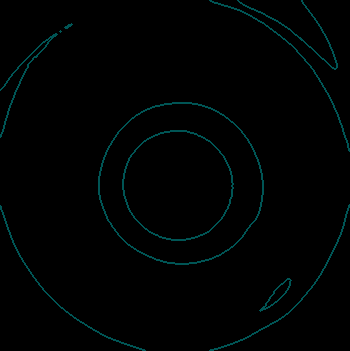
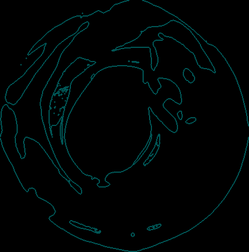

# FastConsumableQC.Vision

## Requirements
- Python 3.11
- skimage: `pip install scikit-image`
- OpenCV: `pip install opencv-python`

## Foldering Structure
```
FastConsumableQC.Vision
├── assets
├── dataset
├── image_dump
├── log
├── models
├── test_images
└── src
    ├── Common
        ├── Label.py
        ├── Logger.py
        └── VisionCommon.py
    ├── HighLevelProcessor
        └── TipQCDetector.py
    ├── LowLevelProcessor
        ├── GreyProcessor.py
        └── RoiProcessor.py
    ├── Utils
        └── FrameGrabber.py
    ├── main.py
    ├── Playground.py
    └── VisionWrapper.py 
```

## Run the code:
- Set active directory to `/FastConsumableQC.Vision/src/`
- `python main.py`

## How to use:
- You could input a single image, camera stream, or a folder that contains many images by modifying ```main.py```.
- Example for inferencing by inputing a folder.
    ```
    folderPath = 'dataset'
    result = visionWrapper.ExecuteTipQClassificationOnFolder(folderPath)
    ```
- Example for inferencing by inputing a single image.
    ```
    folderPath = 'dataset'
    imagePath = os.path.join(folderPath, '965.png')
    result = visionWrapper.ExecuteTipQCClassification(imagePath)
    ```
- Example for inferencing by inputing a camera stream.

    ```result = visionWrapper.ExecuteTipQCClassification()```
- The classification result will be printed in the terminal.   

## Result
- The dumped images will be stored inside `/FastConsumableQC.Vision/image_dump/` directory.

### Highlevel Overview
- Image processing pipeline:
    - Raw image => Binary image => ROI (of raw image) => Segmented image (3 pixel values) => Classification

### Dumped image (Class: GO)
- Raw image (1600x1200) => Binary image (1600x1200) => ROI image (350x351 => Vary for each images) => Segmented image (350x351 => Vary for each images)

      

### Dumped image (Class: Arguably Good)
- Raw image (1600x1200) => Binary image (1600x1200) => ROI image (350x351 => Vary for each images) => Segmented image (350x351 => Vary for each images)

      

### Dumped image (Class: NG)
- Raw image (1600x1200) => Binary image (1600x1200) => ROI image (350x351 => Vary for each images) => Segmented image (350x351 => Vary for each images)

      

### Final Classification Result
- Final decision is based on segmented image.