# FastConsumableQC.Vision

(The repo is still under construction)

## Problem Definition
Upon examining sample images of tips, several critical issues have been identified. These issues include inconsistent tip geometry, such as irregularities in the shape of the tip end, as well as surface defects and anomalies that compromise the integrity of the tips. These visual discrepancies highlight the urgent need for an automated inspection solution to ensure consistent quality and reliability of produced tips. The primary focus should be on reducing the false positive rate to achieve high precision, while also maintaining good accuracy with an acceptable false negative rate (good recall). Implementing such a system will enhance overall production efficiency.

## Requirements
- Python 3.11
- skimage: `pip install scikit-image`
- OpenCV: `pip install opencv-python`
- Recommended to use [Anaconda](https://www.anaconda.com/download/success).

## Foldering Structure
```
FastConsumableQC.Vision
├── assets
├── config
    └── config.json
├── dataset
├── log
├── models
└── src
    ├── Common
        ├── JsonLoader.py
        ├── Label.py
        ├── Logger.py
        ├── RunningMode.py
        └── VisionCommon.py
    ├── HighLevelProcessor
        └── TipQCDetector.py
    ├── LowLevelAnalyzer
        └── CircleChecker.py
    ├── LowLevelProcessor
        ├── BasicVisualizer
            └── BoundingBoxDrawer.py
        ├── BinaryProcessor.py
        ├── BoundaryProcessor.py
        ├── GreyProcessor.py
        ├── RoiProcessor.py
        └── SmallObjectRemover.py
    ├── Utils
        └── FrameGrabber.py
    ├── main.py
    ├── Playground.py
    └── VisionWrapper.py
```

## Run the code:
- Set active directory to `/FastConsumableQC.Vision/src/`
- Set the ```config.json``` file.
    ```
    "runningMode": "Folder", // 3 running modes: Folder, File, or Camera
    "folderPath": "dataset", // folder path to be detected
    "imagePath": "5146.png", // image path to be detected (no need to be specified if mode is Folder or Camera)
    "cameraIndex": 0, // Camera Index
    "isTrainTipQC": false, // Condition whether to train the segmentation model or not
    "imageToTrain": "dataset\\965.png" // Image to train the segmentation model (do not need to change this in order to run this code)
    ```
- `python main.py`

## Running Issues
- If there is an incompatibale version issue regarding the loaded model, you can re-create the `model.pkl` by changing `isTrainTipQC = true` in `config.json`, then `python main.py`. This will only take a few seconds to complete. Later, you need to change it back to `isTrainTipQC = false` for inferencing in another mode.

## Result
- Currently, the result has not been finalized yet, this code only print the score of plunger surface analyzer.
- The dumped image logs and log.txt file will be stored inside `/FastConsumableQC.Vision/log/` directory.

### Highlevel Overview of Processing Pipeline
- Image processing pipeline:
    - Raw => Binary => Clean binary => (Bounding box ROI, ROI) => Segmented image => Image Boundaries => Plunger surface
    - Score calculation:
        - Analyze plunger surface circle (This score is sufficient to classify a tip as NG class, but not sufficient for classification as G class, still need to be combined with another score analyzer)
    - However, I found more schemes to completely solve the problem, but just have not done it yet. Please consider it in section of [Plan To Improve](#plan-to-improve).

### Dumped image 1
- Raw => Binary => Clean binary => (Bounding box ROI, ROI) => Segmented image => Image Boundaries => Plunger surface (Score: 0.8251)

  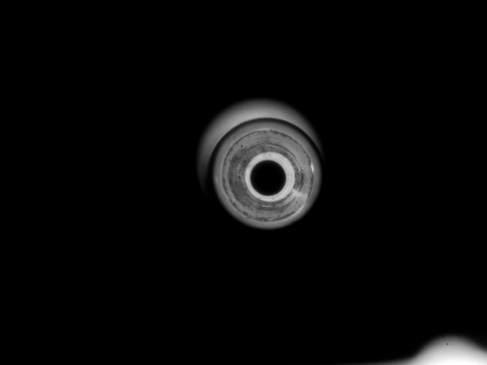 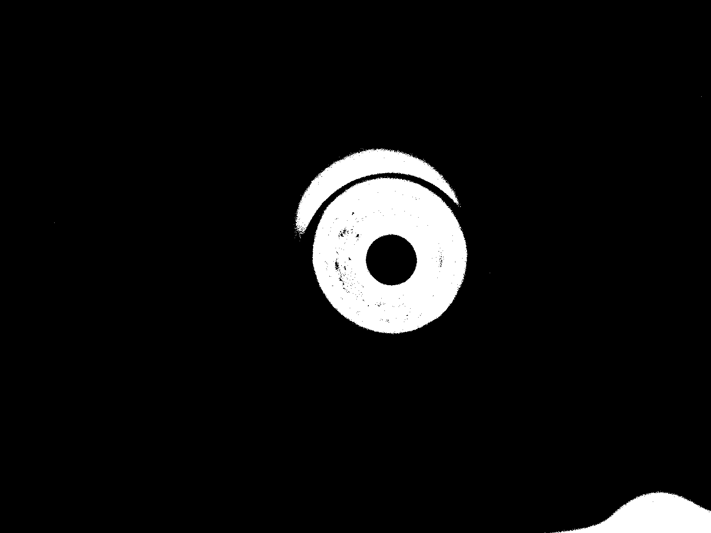  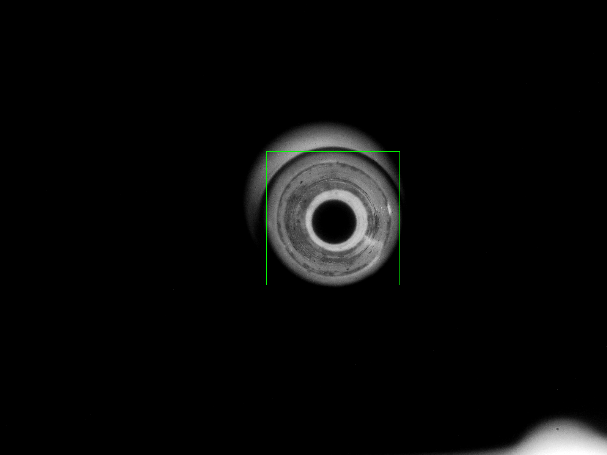 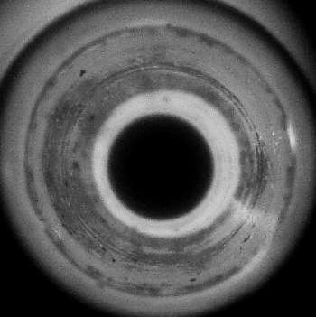  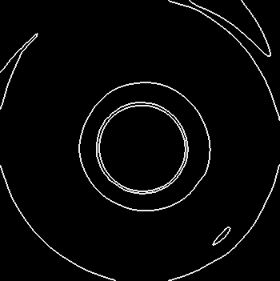 

### Dumped image 2
- Raw => Binary => Clean binary => (Bounding box ROI, ROI) => Segmented image => Image Boundaries => Plunger surface (Score: 0.8747)

   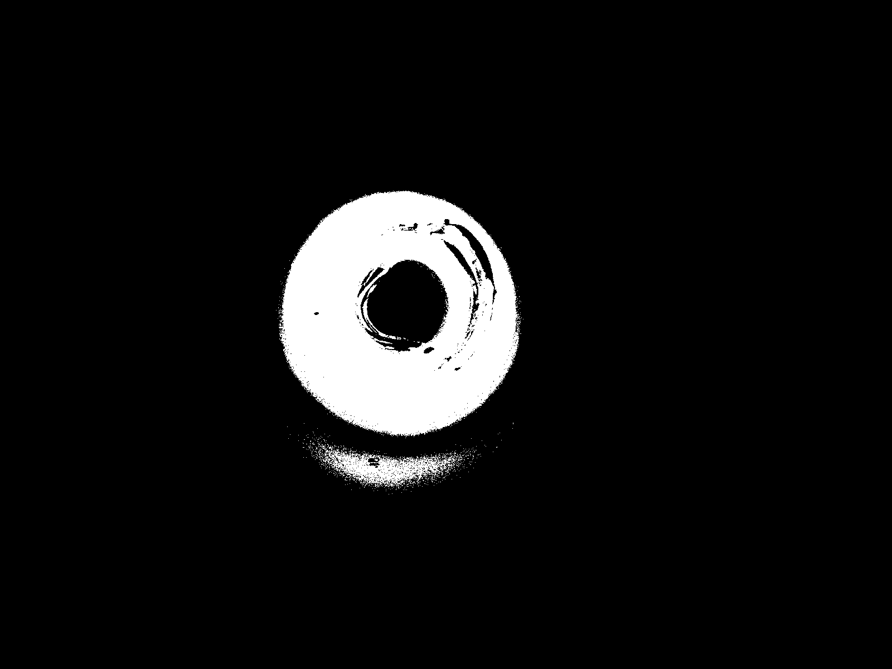 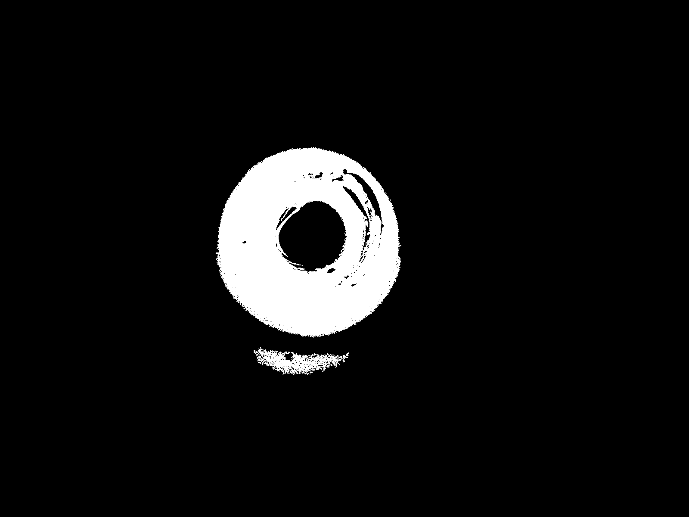 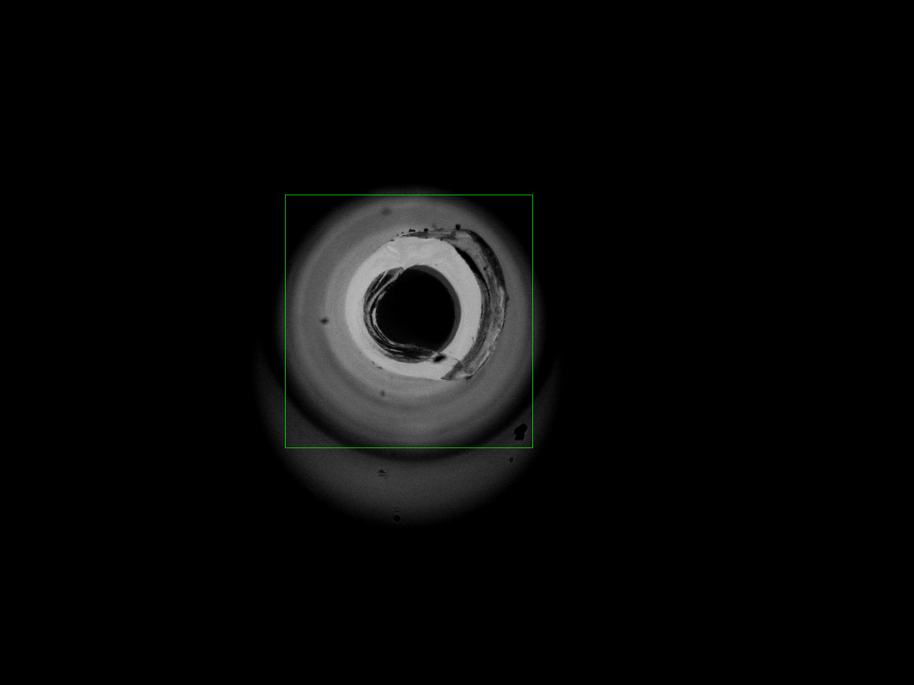 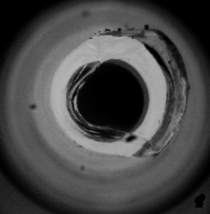 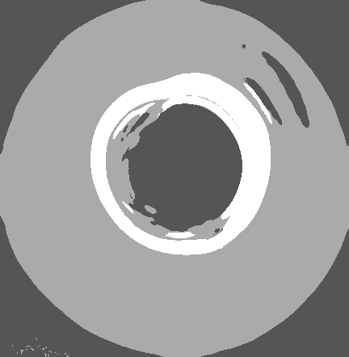 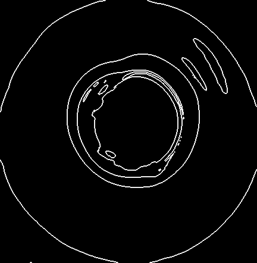 

### Dumped image 3
- Raw => Binary => Clean binary => (Bounding box ROI, ROI) => Segmented image => Image Boundaries => Plunger surface (Score: 0.2679)

  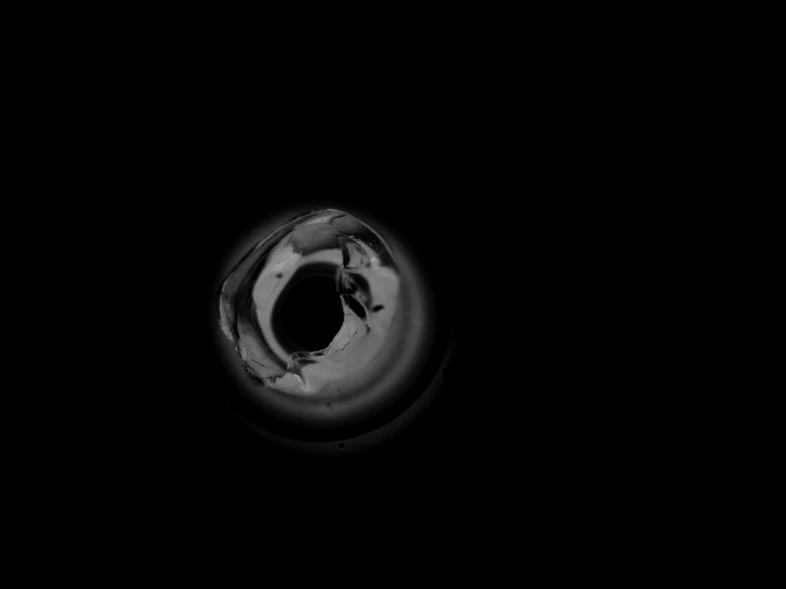  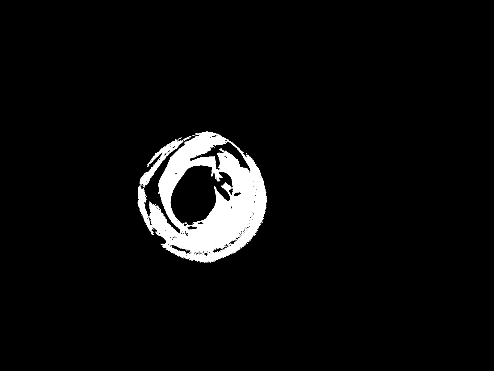 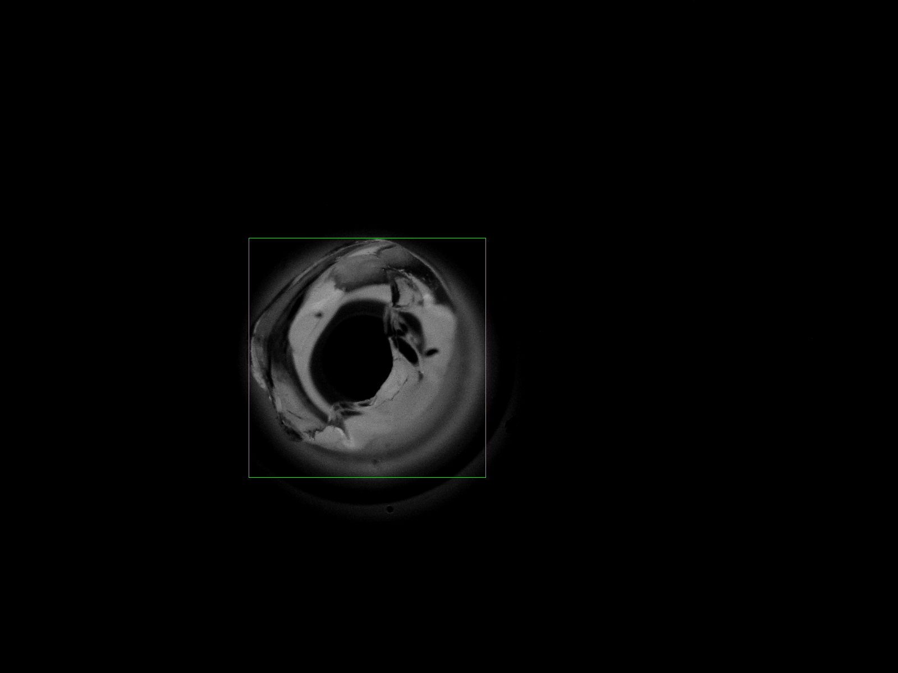  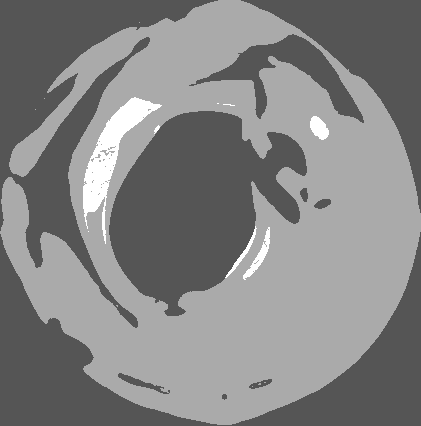  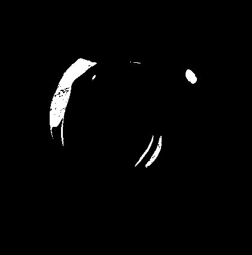

## Plan to Improve
- The following scheme possibly could improve the robustness, escpecially when the objective is to improve the precision (low false positive) but keep maintaining good accuracy (acceptable false negative rate).


## References
- https://scikit-image.org/docs/stable/auto_examples/segmentation/plot_trainable_segmentation.html
- https://scikit-image.org/docs/stable/api/skimage.future.html#skimage.future.fit_segmenter
- https://scikit-image.org/docs/stable/api/skimage.feature.html
- https://scikit-image.org/docs/stable/api/skimage.segmentation.html