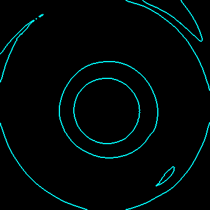
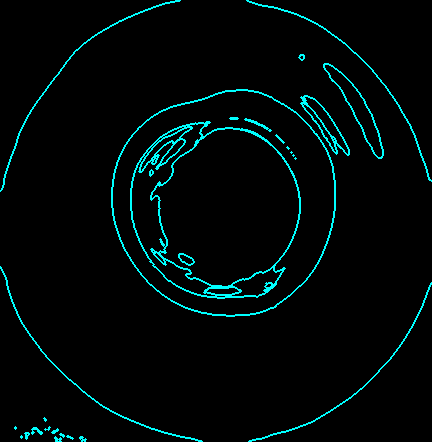
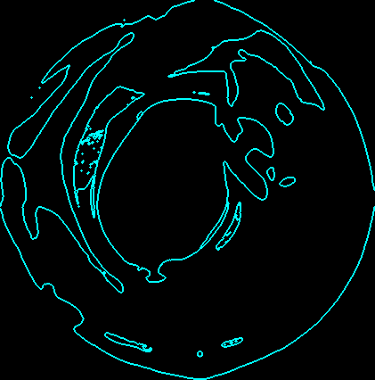

# FastConsumableQC.Vision

## Problem Definition
The repository addresses critical challenges in the production of tips through injection molding. With a high rejection rate and manual inspection prone to errors, there is a pressing need for an automated solution. This repository hosts an in-house developed vision-based inspection system designed to enhance production efficiency by accurately identifying defective tips. The system aims to mitigate issues such as false positives and negatives, ensuring consistent quality while improving overall yield rates.

Upon examining sample images of tips, several critical issues have been identified. These issues include inconsistent tip geometry, such as irregularities in the shape of the tip end. Additionally, there are instances of surface defects and anomalies that compromise the integrity of the tips. Furthermore. These visual discrepancies highlight the urgent need for an automated inspection solution to ensure consistent quality and reliability of produced tips, reducing rejection rates and enhancing overall production efficiency.

## Requirements
- Python 3.11
- skimage: `pip install scikit-image`
- OpenCV: `pip install opencv-python`

## Foldering Structure
```
FastConsumableQC.Vision
├── assets
├── dataset
├── image_dump
├── log
├── models
├── test_images
└── src
    ├── Common
        ├── Label.py
        ├── Logger.py
        └── VisionCommon.py
    ├── HighLevelProcessor
        └── TipQCDetector.py
    ├── LowLevelProcessor
        ├── BoundaryProcessor.py
        ├── GreyProcessor.py
        └── RoiProcessor.py
    ├── Utils
        └── FrameGrabber.py
    ├── main.py
    ├── Playground.py
    └── VisionWrapper.py 
```

## Run the code:
- Set active directory to `/FastConsumableQC.Vision/src/`
- `python main.py`

## How to use:
- You could input a single image, camera stream, or a folder that contains many images by modifying ```main.py```.
- Example for inferencing by inputing a folder.
    ```
    folderPath = 'dataset'
    result = visionWrapper.ExecuteTipQClassificationOnFolder(folderPath)
    ```
- Example for inferencing by inputing a single image.
    ```
    folderPath = 'dataset'
    imagePath = os.path.join(folderPath, '965.png')
    result = visionWrapper.ExecuteTipQCClassification(imagePath)
    ```
- Example for inferencing by inputing a camera stream.

    ```result = visionWrapper.ExecuteTipQCClassification()```  

## Result
- The classification result will be printed in the terminal. 
- The dumped image logs will be stored inside `/FastConsumableQC.Vision/image_dump/` directory.

### Highlevel Overview
- Image processing pipeline:
    - Raw image => Binary image => ROI => Segmented image (3 parts) => Image Boundaries => Classification

### Dumped image (Class: GO)
- Raw image => Binary image => ROI image => Segmented image => Image Boundaries

      

### Dumped image (Class: Arguably Good)
- Raw image => Binary image => ROI image => Segmented image => Image Boundaries

      

### Dumped image (Class: NG)
- Raw image => Binary image => ROI image => Segmented image => Image Boundaries

      

### Final Classification Result
- Final decision is based on segmented image.