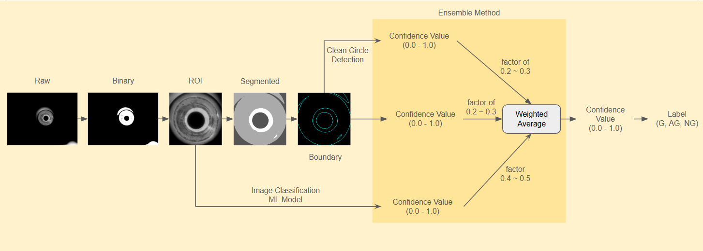

# FastConsumableQC.Vision

## Problem Definition
Upon examining sample images of tips, several critical issues have been identified. These issues include inconsistent tip geometry, such as irregularities in the shape of the tip end, as well as surface defects and anomalies that compromise the integrity of the tips. These visual discrepancies highlight the urgent need for an automated inspection solution to ensure consistent quality and reliability of produced tips. The primary focus should be on reducing the false positive rate to achieve high precision, while also maintaining good accuracy with an acceptable false negative rate (good recall). Implementing such a system will enhance overall production efficiency.

## Requirements
- Python 3.11
- skimage: `pip install scikit-image`
- OpenCV: `pip install opencv-python`

## Foldering Structure
```
FastConsumableQC.Vision
├── assets
├── dataset
├── log
├── models
└── src
    ├── Common
        ├── Label.py
        ├── Logger.py
        └── VisionCommon.py
    ├── HighLevelProcessor
        └── TipQCDetector.py
    ├── LowLevelProcessor
        ├── BasicVisualizer
            └── BoundingBoxDrawer.py
        ├── BinaryProcessor.py
        ├── BoundaryProcessor.py
        ├── GreyProcessor.py
        ├── RoiProcessor.py
        └── SmallObjectRemover.py
    ├── Utils
        └── FrameGrabber.py
    ├── main.py
    ├── Playground.py
    └── VisionWrapper.py 
```

## Run the code:
- Set active directory to `/FastConsumableQC.Vision/src/`
- `python main.py`

## How to use:
- You could input a single image, camera stream, or a folder that contains many images by modifying ```main.py```.
- Example for inferencing by inputing a folder.
    ```
    folderPath = 'dataset'
    result = visionWrapper.ExecuteTipQClassificationOnFolder(folderPath)
    ```
- Example for inferencing by inputing a single image.
    ```
    folderPath = 'dataset'
    imageName = '965.png'
    imagePath = os.path.join(folderPath, imageName)
    result = visionWrapper.ExecuteTipQCClassification(imagePath)
    ```
- Example for inferencing by inputing a camera stream.

    ```result = visionWrapper.ExecuteTipQCClassification()```  

## Result
- The classification result will be printed in the terminal. 
- The dumped image logs and log.txt file will be stored inside `/FastConsumableQC.Vision/log/` directory.

### Highlevel Overview of Processing Pipeline
- Image processing pipeline:
    - Raw => Binary => Clean binary => (Bounding box ROI, ROI) => Segmented image => Image Boundaries => Plunger surface
    - Final Classification:
        - Analyze plunger surface circle
        - Analyze the cleaness of boundary image
    - However, I found more schemes to completely solve the problem, but just have not done it yet. Please consider it in section of [Plan To Improve](#plan-to-improve).

### Dumped image 1
- Raw => Binary => Clean binary => (Bounding box ROI, ROI) => Segmented image => Image Boundaries => Plunger surface

         

### Dumped image 2
- Raw => Binary => Clean binary => (Bounding box ROI, ROI) => Segmented image => Image Boundaries => Plunger surface

         

### Dumped image 3
- Raw => Binary => Clean binary => (Bounding box ROI, ROI) => Segmented image => Image Boundaries => Plunger surface

         

## Plan to Improve
- The following scheme possibly could improve the robustness, escpecially when the objective is to improve the precision (low false positive) but keep maintaining good accuracy (acceptable false negative rate).



## References
- https://scikit-image.org/docs/stable/auto_examples/segmentation/plot_trainable_segmentation.html
- https://scikit-image.org/docs/stable/api/skimage.future.html#skimage.future.fit_segmenter
- https://scikit-image.org/docs/stable/api/skimage.feature.html
- https://scikit-image.org/docs/stable/api/skimage.segmentation.html